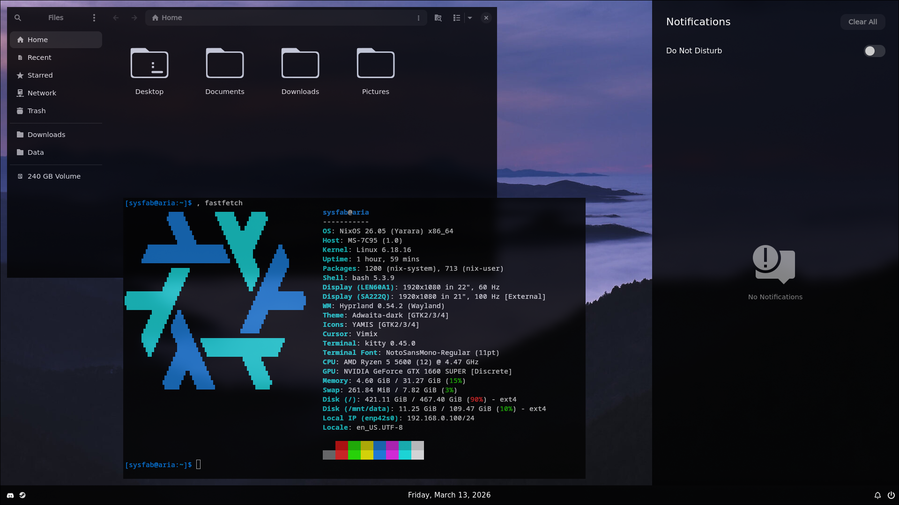
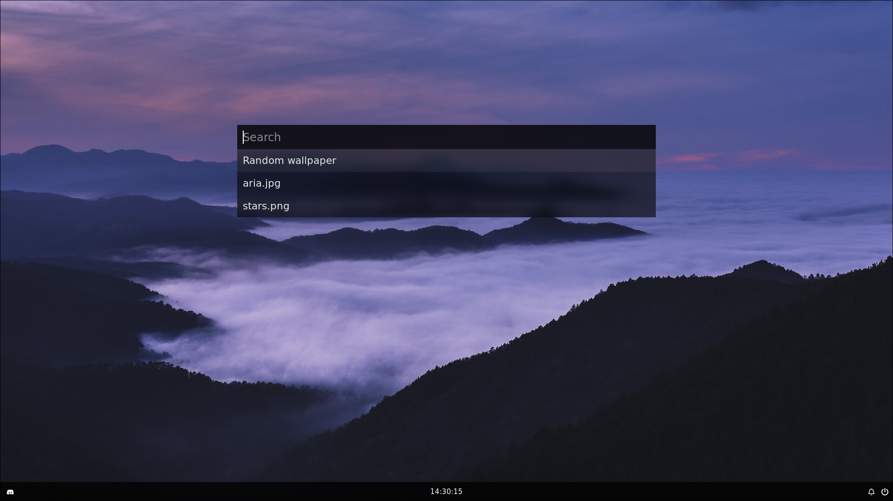

# Aria!

Minimalistic x86_64 NixOS configuration  
It's a public part of my config

# Images

  
  

## How to use?

Recommended way to use it - import in flake repo:
```nix
{
    inputs = {
        aria.url = "github:sysfab/aria";
    };
}
```

And then:
```nix
imports = [
    # Use specific modules:
    inputs.aria.nixosModules.git

    # Or all:
    inputs.aria.all.system #for nixosConfigurations
    inputs.aria.all.home #for homeConfigurations
]
```

Or clone the repo and grab the modules you want in your flake (safest option)
